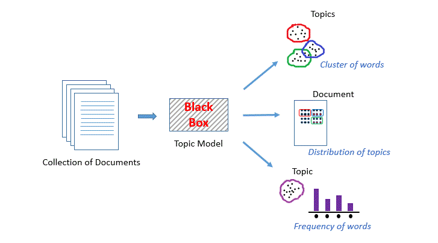

# Topic Modeling Explained

## What is Topic Modeling?

Topic modeling is a machine learning technique used to automatically discover hidden topics in a large collection of text documents. It groups words that frequently occur together into "topics" and assigns each document a mix of these topics, helping us understand the main themes or subjects in the data without reading everything. 

It’s commonly used in analyzing articles, reviews, or social media content to uncover patterns or insights.

---

## How It Works

1. **Input Data**: A collection of text documents.
2. **Modeling**: An algorithm like Latent Dirichlet Allocation (LDA) identifies word patterns.
3. **Output**: A set of topics and the proportion of each topic in every document.

---

## Applications

- **Customer Feedback Analysis**: Understand key themes in customer reviews.
- **News Clustering**: Group articles by topic.
- **Social Media Insights**: Identify trending discussions.

---

# Findings from Topic Modeling on 61,594 Reviews

---

### **1. Data Preparation Summary**

- **Initial Dataset Size**: 61,594 reviews.
- **Duplicates Removed**: 238 duplicate reviews were removed, leaving **61,356 unique reviews**.
- **Post-Preprocessing Dataset**: After cleaning and tokenization (e.g., removing stopwords, punctuation, and lemmatization), the dataset consisted of **61,339 reviews**.

---

### **2. Application of LDA and Topic Distribution**

Using **Latent Dirichlet Allocation (LDA)**, the cleaned reviews were analyzed and categorized into **7 distinct topics** based on their semantic structure.

---

### **3. Topic Contributions and Interpretation**

| **Topic ###** | **Theme**                              | **Contribution (%)** | **No. of Reviews** | **Top Words**                                | **Key Insights**                                                                 |
|-------------|----------------------------------------|-----------------------|---------------------|---------------------------------------------|----------------------------------------------------------------------------------|
| **Topic-1** | **Playlist Management**                | 16.5%                | ~10,107 reviews     | playlist, add, want, listen, like            | Users discuss playlist interactions, such as adding, removing, and shuffling songs. |
| **Topic-2** | **Technical Issues and Connectivity**  | 9.5%                 | ~5,827 reviews      | try, log, work, account, connection          | Concerns about login problems, account issues, and connectivity problems.         |
| **Topic-3** | **Ads and Premium Services**           | 12.2%                | ~7,476 reviews      | ads, premium, free, listen, pay              | Feedback about ads, premium subscriptions, and payment-related concerns.          |
| **Topic-4** | **User Appreciation**                  | 13.5%                | ~8,180 reviews      | love, best, great, smile, listen             | Positive feedback highlighting satisfaction with app features and quality.         |
| **Topic-5** | **Podcasts and Music Preferences**     | 14.2%                | ~8,706 reviews      | podcast, playlists, radio, artists, feature  | Users express preferences for podcasts, radio, and music content.                  |
| **Topic-6** | **Subscription and Offline Access**    | 14.4%                | ~8,831 reviews      | download, premium, offline, subscription, pay| Concerns about downloads, offline mode, and subscription cancellations.            |
| **Topic-7** | **App Performance and Bugs**           | 19.7%                | ~12,203 reviews     | play, stop, update, fix, crash               | Highlighting crashes, bugs, and app performance issues.                            |

---

### **4. Key Findings**

#### **4.1 Most Dominant Topic**
- **App Performance and Bugs** (Topic 7) emerged as the most dominant theme, contributing **19.7%** (~12,203 reviews) of the dataset.
- This highlights significant user concerns about app crashes, bugs, and performance issues, which require immediate attention.

#### **4.2 Playlist and Content Management**
- **Playlist Management** (Topic 1) accounts for **16.5%** (~10,107 reviews), indicating the importance of optimizing playlist-related features like adding, removing, and shuffling songs.

#### **4.3 Ads and Premium Concerns**
- **Ads and Premium Services** (Topic 3) form **12.2%** (~7,476 reviews), reflecting concerns about intrusive ads and payment systems for premium subscriptions.

#### **4.4 User Sentiments**
- **User Appreciation** (Topic 4) accounts for **13.5%** (~8,180 reviews), showing satisfaction and positive feedback about the app’s features and overall quality.

#### **4.5 Audio Content and Offline Access**
- Topics related to **Podcasts/Music Preferences** (Topic 5) and **Subscription/Offline Access** (Topic 6) together account for **28.6%** (~17,537 reviews), highlighting the demand for audio content and seamless offline usability.

---

### **5. Business Implications**

1. **Prioritize App Stability**:
   - With **19.7%** of the reviews highlighting bugs and crashes, app stability should be the top priority.

2. **Enhance Playlist Features**:
   - Given the **16.5%** focus on playlist management, enhancing user experience with playlists can significantly boost satisfaction.

3. **Improve Ad Experience and Subscriptions**:
   - Address feedback on ads and simplify premium subscription features to attract more users to paid plans.

4. **Leverage Positive Feedback**:
   - Utilize **13.5%** positive reviews to reinforce and market the app’s strengths.

5. **Focus on Podcasts and Offline Features**:
   - The demand for audio content and offline usability is evident from **28.6%** of the reviews, suggesting opportunities to expand in this area.

---

### **6. Conclusion**

The analysis of **61,339 reviews** provides valuable insights into user behavior and concerns. Addressing the top themes, particularly **App Performance and Bugs** and **Playlist Management**, can significantly enhance user satisfaction and retention.
